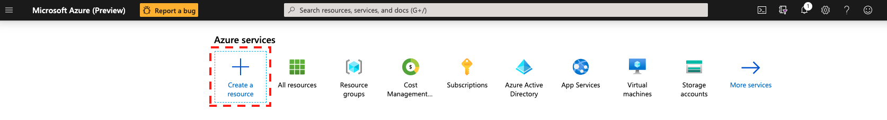
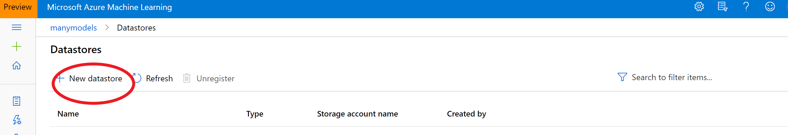

# Module 1 - Azure Machine Learning for Business Data Scientists

## Hands-On exercises

### Exercise 1
Creating an Azure ML workspace using the portal

1. In you Azure portal navigate to 'Create a resource' and click

2. In 'Azure Marketplace' tab navigate to 'AI + Machine Learning' tab select 'Machine Learning' and click

3. Type a name for the workspace and select (or create a new) resource group, location and edition of the workspace (see details [here](https://docs.microsoft.com/en-us/azure/machine-learning/overview-what-is-azure-ml#sku)). Click on "Review + Create" and then "Create"

This process will create the following resources:

4. Wait for deployment and then click on "Go to resource"

5. In the resource blade, you have access to all the meta data needed to refer to your workspace e.g. name, resource group, etc. (you can download all these info as a json file, "config.json"). To access Azure Machine Learning Studio click on "Launch now"

This will take you to your Azure ML studio

### Excercise 1: Setting up the Compute Targets

### Prerequisites

To run through below instructions, you need an Azure subscription and an Azure ML workspace. See instructions on how to create a workspace [here](../../../0-Setup/README.md) and more details [here](https://docs.microsoft.com/en-us/azure/machine-learning/service/how-to-manage-workspace).

#### Creating an AzureML compute cluster

We will do a number of actions that require a compute target to be exectuted on. We will start by creating a cluster of CPU VMs.

1. Navigate to 'Compute' > 'Training Clusters' in the "Manage" section and click 'New'.

1. Call the cluster 'cpu-cluster'.
    - For machine size choose 'Standard_D2_v2' (that is an inexpensive general purpose VM size at about $0.14/hour). See details about AzureML compute pricing [here](https://azure.microsoft.com/en-us/pricing/details/machine-learning/).
    - Set the 'minimum number of nodes' to 0 and the  the 'maximum number of nodes' to 10. That way the cluster will scale automatically to up to 10 nodes as jobs require them.
    - Set the 'Idle seconds before scale down' to 10800. That means that nodes will be kept around for 3 hours before they are spun down. That way, during our workshop, jobs won't have to wait for spin-up. Make sure that number is lower if you are using a more expensive VM size.

### Creating an AzureML Compute Instance

Next, we will create a compute instance. The compute instance will serve as an interactive workstation in the cloud that serves as a Jupyter server, but also hosts and instance of RStudio server and can run TensorBoard, Bokeh, Shiny or other apps used during the developement work of a data scientist.

1. Navigate to 'Compute Instance' tab in Compute and click on 'New'.
 
1. Choose some sufficiently unique name, keep the default VM type (STANDARD_DS3V2 -- a fairly inexpensive machine type costing about $0.27/hour) and click 'Create':

See [here](https://docs.microsoft.com/en-us/azure/machine-learning/service/how-to-configure-environment#notebookvm) for details on creating AzureML Notebook VMs.

**Note that this machine will keep running until you stop it from the portal.**

### Exercise 3
Creating a dataset from a datastore

### Datasets and Datastores

The AzureML studio allows the user to manage their dataset and datastores directly inside the portal. 

A Dataset is a resource for exploring, transforming and managing data in Azure Machine Learning. 
Datasets enable:

- Easy access to data: without worrying about connection strings or data paths. Only keep a single copy of data in the storage service of your choice.

- Training with big data: seamless integration with Azure Machine Learning features like labelling, training products and pipelines. Users can share and reuse datasets in various experiments.

- Tracking data usage: Azure ML automatically tracks which version of the dataset was used for the ML experiment and produced which model.

### Uploading a Dataset to AzureML studio

1. Here we are using German credit dataset: https://raw.githubusercontent.com/mozamani/aml_workshop_template/master/Data/german_credit_data.csv

2. Navigate to the left pane of your workspace. Select Datasets under the Assets section

Click on 'Create dataset' and choose 'From web files'. Copy/Paste the above URL in the Web URL box, name the dataset '**german_credit**' and then click 'Next'. Make sure to leave the dataset type as Tabular.

3. From 'Column headers' drop-down select 'Use headers from the first file'

4. Click 'Next' through the following "Settings and preview" and "Schema" sections to verify that everything looks correct.

5. Finally, in the "Confirm Details" section, select "Profile this dataset after creation" and specify the 'cpu-cluster' that you previously created as the compute to use for profiling

### Explore the dataset

1. Now, click on the newly created dataset and click 'Explore'. Here you can see the fields of the Tabular dataset.

1. To view the profile of the dataset we generated in the previous step, click the "Profile" tab. If you want to regenerate a profile (or you created the dataset without selecting the profile option), you can  click "Generate profile" and select a cluster to generate profile information for the dataset.

For more information on datasets, see the how-to for more information on creating and using Datasets. https://docs.microsoft.com/en-us/azure/machine-learning/service/how-to-create-register-datasets

### [Optional] - creating a datastore

In case data, residing in an Azure Storage, is being loaded into Azure Machine Learning one should create a datastore first.
For this it is important to have an Azure storage account with an Azure blob container or Azure file share. Link to create an Azure storage account: https://docs.microsoft.com/en-us/azure/storage/blobs/storage-blob-create-account-block-blob?tabs=azure-portal

1. Click 'Datastores' on the left pane under Manage.

2. Click create 'New datastore'.

3. Fill in the form for a new datastore. 

Information regarding the SAS token can be found in Access keys on the settings pane. For service principals navigate to App registrations and select the designated app.

For more information on how to access data please check the following link: https://github.com/microsoft/azure-docs/blob/master/articles/machine-learning/how-to-access-data.md

### Datasets & versioning in AML

Dataset versioning is a way to bookmark the state of your data so that you can apply a specific version of the dataset for future experiments.

This tutorial consists of two separate steps where the first one is necessary to start an automated ML run based on the first version of the dataset. The second part of the tutorial  focuses on creating a second version of the dataset. 

**When do you version a dataset?**

•	When new data is available for retraining

•	When you're applying different data preparation or feature engineering approaches

### Register and retrieve dataset versions

By registering a dataset, you can version, reuse, and share it across experiments and with colleagues. You can register multiple datasets under the same name and retrieve a specific version by name and version number.

**Good to know:**

•	When you create a dataset version, you're not creating an extra copy of data with the workspace. Because datasets are references to the data in your storage service, you have a single source of truth, managed by your storage service.

•	When you load data from a dataset, the current data content referenced by the dataset is always loaded. If you want to make sure that each dataset version is reproducible, we recommend that you not modify data content referenced by the dataset version. When new data comes in, save new data files into a separate data folder and then create a new dataset version to include data from that new folder.

•	You can use a dataset as the input and output of each Machine Learning pipeline step. When you rerun pipelines, the output of each pipeline step is registered as a new dataset version. Because Machine Learning pipelines populate the output of each step into a new folder every time the pipeline reruns, the versioned output datasets are reproducible.

In the first part of this tutorial you are going to register a dataset which will automatically be versioned as version 1. In the second part of the tutorial it is explained how to create a second version (version 2) of the original dataset (version 1).

## Creating a second version of the dataset

Step 1: Go to **datasets**, click on the **dataset** you have a new version for:

Step 2: click on **new version** and choose from which location you want to pick up the new version:

Step 3: Fill in the necessary information (e.g. what type of change happened in the description) walk through the same steps as in part 1 (datastore and file section, setting and preview, schema, confirm details). Notice that in basic information it automatically states which version this is of the dataset and the ability to add a description to what has changed (red circles).

Step 4: when the new dataset is uploaded, two versions of the capadataset can be found.

This is the end of part 1 of the workshop focused on loading datasets into AML and how to version those datasets. 

### Exercise 4
Azure ML Designer from training to deploying in a no code fashion

### Exercise 5
Create your first Automated ML experiment
With best model explainability

## Additional Links

* [Microsoft](https://microsoft.com)
* [Build, train, and deploy machine learning models with an Azure free account](https://azure.microsoft.com/en-us/free/services/machine-learning/)
* [Azure ML](https://azure.microsoft.com/en-us/services/machine-learning/)
* [Azure ML documentation](https://docs.microsoft.com/en-us/azure/machine-learning/)
* [Getting Started](https://docs.microsoft.com/en-us/azure/machine-learning/)
* [Azure ML GitHub](https://github.com/Azure/MachineLearningNotebooks/)
* [Learn Azure ML with Microsoft Learn](https://docs.microsoft.com/en-us/learn/browse/?products=azure&roles=data-scientist)
